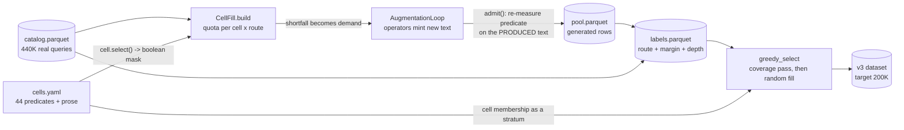
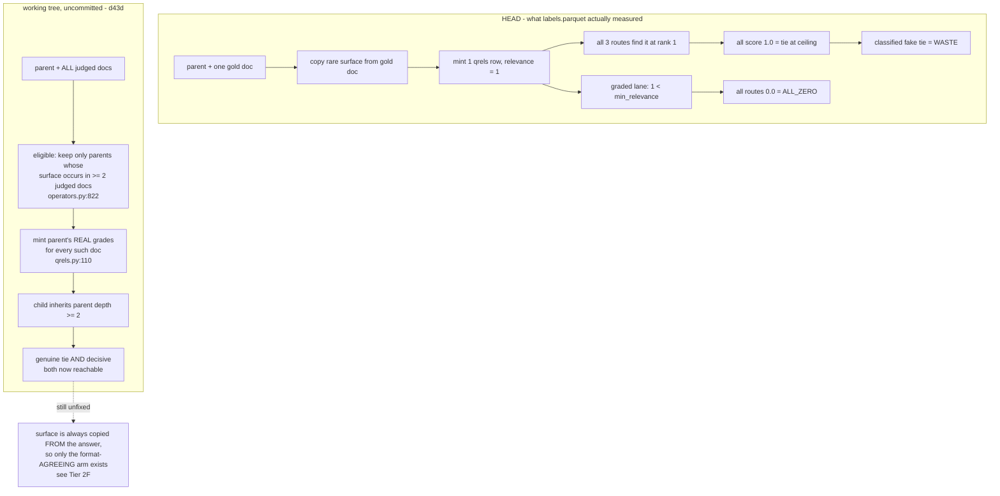
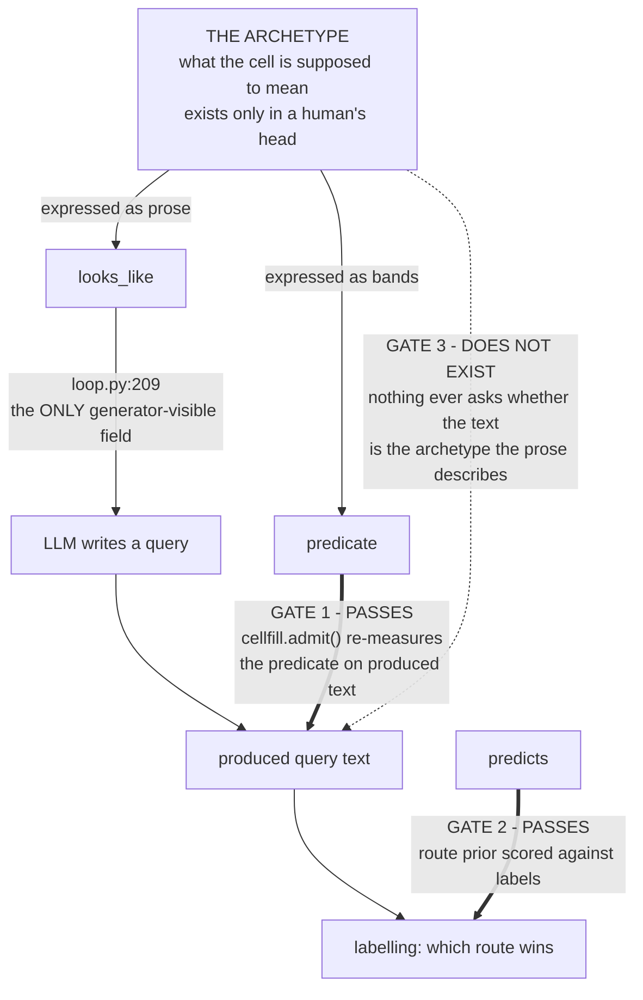
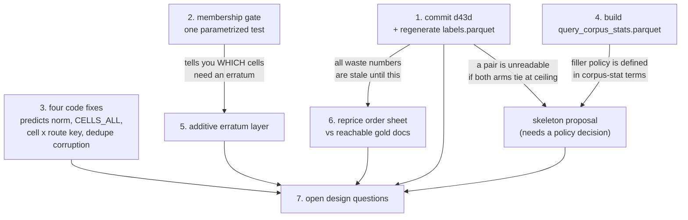
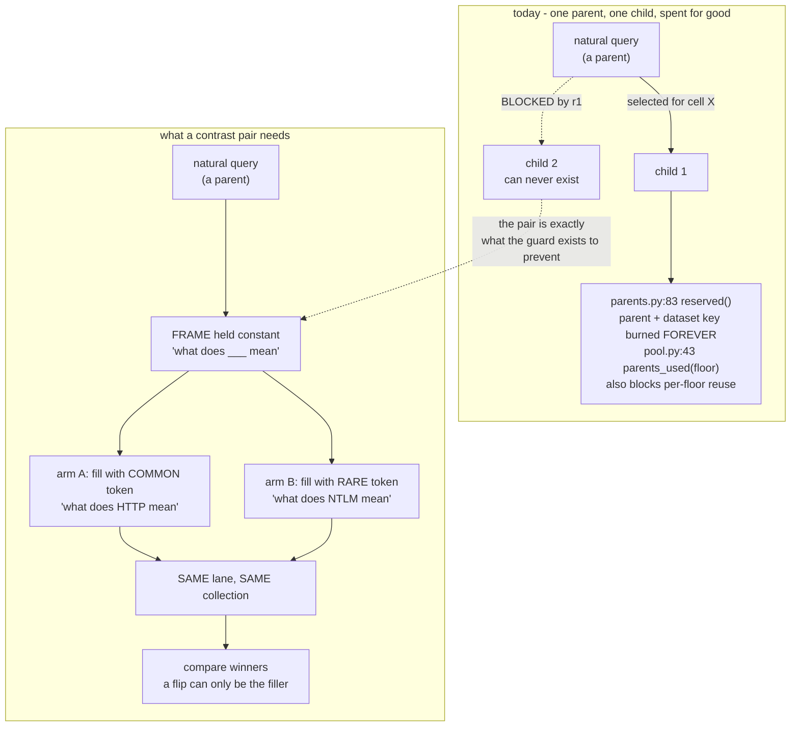

# Adversarial review — `src/composition/cells.yaml`

*Audit of the 44 frozen v2 cells (plus the 5 additive v3 cells) against the v3
generation objective. Read `docs/v3_generation_brief.md` first — this document
assumes it.*

Date: 2026-08-19. Reviewed artifact: `src/composition/cells.yaml` @ `dataset-v2`.

---

## What this is and how to read it

Eight read-only review agents (1 fable, 3 opus, 4 sonnet) audited `cells.yaml`
against the objective *"select decisive, diverse, real-world-representative,
useful queries for training a dense/sparse/hybrid router."* Each was given a
different lens so the reports would not collapse into eight copies of the same
critique, and each was required to write a steelman of the design against its
own findings.

Every agent was held to the project's standing constraints: cells are a-priori
archetypes, a thin cell is a generation target and never a pruning candidate, no
ranking of cells by current supply, and every proposed fix must land as an
additive artifact because v2 is frozen.

**Provenance markers.** Findings carry a confirmation count:

- `[3x]` — independently reached by three reviewers using different methods.
  Treat as established.
- `[2x]` — two reviewers. Strong.
- `[1x]` — single source. **Spot-check the line numbers before acting.**
- `[verified]` — checked directly in the main session, not agent-sourced.
- `[REFUTED]` — the finding was checked and is **wrong**. Kept in place, struck
  through, with the reason. Do not act on it.

**Two findings were refuted on re-check — see "Refuted findings" below before
reading Tier 1.** Both were originally ranked as the highest-leverage items in the
audit. The reviewers read `AugmentationQrels.mint` (`qrels.py:49-68`) and never
opened `_minted_rows` (`:110`) or `InjectOperator.eligible` (`:800-822`), where the
guard they claimed was missing already exists.

**A second staleness problem follows from that.** The `d43d` fix is present in the
working tree but **not in HEAD** (`git show HEAD:src/augmentation/qrels.py` has no
`>= 2` guarantee), and `data/route_labels/labels.parquet` was produced by the
pre-fix code. So every waste measurement quoted in this document — the 47% waste
total, 13,536 of 15,018 ties being fake, and all per-cell tie / `all_zero` rates in
Tier 2I — **describes behaviour the working tree no longer has.** Regenerate before
acting on any of it.

**One caveat that applies to every per-cell statistic below.** Several reviewers
measured against `data/route_labels/labels.parquet`, an artifact the project
already distrusts at per-cell resolution: `labels.py:237` dedupes to one cell per
query, the selection join sits at ~48% coverage, and 10 of 49 cells have zero
decisive supply. On thin cells (`bare_acronym` 24 rows, `standards_compliance_lookup`
6 rows) any "refutation" is noise. Per-cell numbers are provisional until Phase 3
relabels. Structural and code findings do not carry this caveat.

---

## Verdict

| Lens | Model | Score |
|---|---|---|
| Predicate mechanics (columns, band arithmetic) | sonnet | **7** |
| Partition geometry (overlaps, holes, satisfiability) | fable | **6** |
| Utility objective | opus | 4 |
| Representativity | opus | 4 |
| Fillability & waste | opus | 4 |
| `looks_like` as generation instruction | sonnet | 4 |
| Resolution / redundancy | sonnet | 4 |
| v3 axis seam (corruption, corpus-stats) | sonnet | 4 |

Median **4**.

**The score spread is itself the finding.** The reviewer scoped to mechanical
correctness scored the file **7** and called its core "close to immaculate": all
~150 `column:` references resolve to real catalog columns, `at_least`/`below`
band arithmetic is correct, and the `natural_language_share` thresholds
(0.1 / 0.25 / 0.4) are not freehand — they reproduce `catalog_axes.py:128-132`'s
`NL_SHAPE_AXIS` edges exactly, so the cell layer stays keyed to the canonical
coordinate system. Every reviewer scoped to anything *outside* the YAML scored 4.

**`cells.yaml` is not the defect. Its perimeter is** — the prose that drives
generation, the operators that fill it, and the code that consumes it. Nearly
every fix below is additive by nature rather than merely by constraint.

---

## How the pieces fit

Orientation for anyone reading this cold — findings below reference all of these
files, and most defects live in the *edges*, not the boxes.



Two things to notice, because several findings turn on them:

- `cells.yaml` enters twice — once to drive **generation demand** (`CellFill`),
  once as a **coverage stratum** at selection (`greedy_select`). A defect in the
  predicate is therefore paid for twice.
- `admit()` re-measures the predicate on produced text. That is the one place the
  pipeline checks its own work, and it is genuinely good design. Tier 2A is about
  the check that *isn't* there.

---

## Refuted findings

Checked on re-read and **wrong**. Recorded because they were the audit's top two
recommendations, and because how they failed is instructive: three reviewers
converged on the same conclusion from the same partial read, which is exactly the
failure mode cross-confirmation is supposed to prevent.

### ~~R1. `inject` mints depth-1 qrels, so 24 cells manufacture the waste class~~ `[REFUTED]`

Claimed: `AugmentationQrels.mint` writes one qrels row, so every injected child has
depth 1, every tie is a fake tie at ceiling, and 24 cells can never produce a
hybrid row.

**Already fixed in the working tree (`d43d`).** The reviewers read `mint()`
(`qrels.py:49-68`), which only dispatches, and never opened the two functions that
do the work:

- `operators.py:800-822` — `cand = cand[cand["__depth"] >= 2]`. Only parents where
  the surface occurs in **≥2 judged docs** survive eligibility; `grounding_doc_ids`
  carries all of them.
- `qrels.py:110-133` — `_minted_rows` writes the parent's **real human grades** for
  every one of those docs. Its docstring states the exact mechanism the reviewers
  described as broken: *"the narrowed child keeps its parent's depth instead of
  collapsing to a single doc that scores 1.0 for every route (a fake tie at
  ceiling — d43d fix)."*

### ~~R2. Minted qrels write `relevance: 1` into graded lanes~~ `[REFUTED]`

Claimed: the mint hardcodes `relevance: 1`, so `antique` (min_relevance 3) and
`trec-dl-2022` (2) threshold the key away and every such row becomes `all_zero`.

**Same fix, same file.** `_minted_rows` writes `relevance: rows["relevance"].astype(int)`
— the parent's own grade. The docstring closes with: *"only the grade is the
parent's real judgment, **not the old synthetic 1 that graded lanes then
thresholded to all_zero**."* This was a real bug; it is a fixed one.

### What survives from both

Three things, and they matter:

1. **The fix is uncommitted.** `git show HEAD:src/augmentation/qrels.py` has no
   `>= 2` guarantee. It is unreviewed working-tree work on `dataset-v2`.
2. **Every waste number in this document predates it.** `labels.parquet` was
   produced by the pre-fix code, so the 47% waste total, the 13,536/15,018 fake-tie
   split, and all of Tier 2I's per-cell rates measure behaviour the code no longer
   has.
3. **The one-sidedness half of the claim is untouched by the fix.** Inject still
   draws its surface from a judged document, so the minted token is still
   guaranteed to occur verbatim in the answer — the sparse-favouring arm. The fix
   restored *depth*; it did not add the *disagreeing* arm (reformatted or absent
   identifier) that the cells' own prose asks the generator to vary. Tier 2F still
   holds.



---

## Tier 1 — Live bugs

Code defects, independent of doctrine. Ranked by blast radius. Numbering starts at
2 because the original #1 was refuted above.

### 2. All five v3 cells score 0.000 against their own falsification harness `[1x]`

`cells_v3.yaml` writes class names (`predicts: [sparse]`); labels use route names
(`sparse_only` / `dense_only` / `pure_rrf`); `ArchetypeCell.predicts` is an
unvalidated `tuple[str, ...]` (`cells.py:90`). `route_labels.ipynb` cell 42's
`top in predicts` check therefore reads **all five v3 priors as refuted even when
they are correct** — `high_oov_query`'s top route genuinely is `dense_only`,
`rare_term_query`'s genuinely is `sparse_only`.

**Fix.** A normalizer already exists at `select_v3_prototype.py:47`; route it
through a single `predicts_class` accessor used by every consumer, and state the
vocabulary in `cells_v3.yaml`'s header.

### 3. All five v3 cells are unreachable by generation `[1x]`

`composition/cells.py:150-174` builds `CELLS`, `CELLS_BY_NAME` and
`GENERATION_CELLS` from `cells.yaml` only. `cells_v3.py:24`'s `CELLS_V3` is
imported nowhere except the read-only `select_v3_prototype.py`.
`AugmentationLoop.demand()` (`loop.py:134`) resolves a floor via
`CELLS_BY_NAME.get(floor)` and no operator's `.serves()` matches a bare v3 cell
name — so demanding any v3 cell raises
`ValueError: No registered operator serves ...`.

The five cells whose own header calls them generation targets cannot be
generated.

**Fix.** Additive `CELLS_ALL = CELLS + CELLS_V3` that `demand()` / `plan()` /
`GENERATION_CELLS` read from, leaving `composition.cells.CELLS` untouched.

### 4. `cell × route` is never covered `[1x]`

`select_v3_prototype.py:319-347` initialises `covered_cells` **once, before** the
`for c in CLASSES` loop, so a cell covered during the dense pass yields no gain
during the sparse pass. And `_gain` sums new-cell count and new-lane count 1:1,
so a row covering three cells outranks a row opening a brand-new lane × route
stratum — though lane explains 4.9% of decisiveness variance against cell's 0.15%.

```python
# CURRENT — select_v3_prototype.py:325-347, condensed but faithful
covered_cells: set = set()          # <-- initialised ONCE, OUTSIDE the class loop
covered_flat:  set = set()

def _gain(cand, i, cls):
    ds    = cand.at[i, "dataset"]
    flats = {("lr", ds, cls), ("corr", ...), ("corp", ...)}
    return (len(cand.at[i, "cells"] - covered_cells)     # cells
          + len(flats - covered_flat))                   # lanes -- SUMMED 1:1

for c in CLASSES:                                   # dense, then sparse, then hybrid
    order = sorted(cand.index, key=lambda i: -_gain(cand, i, c))
    ...

# Two consequences:
#  (a) a cell covered during the dense pass scores 0 gain in the sparse pass,
#      so coverage is per-CELL, never per-(cell, route);
#  (b) 3 new cells (0.15% of decisiveness variance) outrank 1 new lane x route
#      (4.9%), because the two terms are added with equal weight.
```

```python
# FIXED — two changes, both in v3 code; cells.yaml never opens
covered_cell_route: set = set()      # keys are (cell, class), not cell
covered_flat:       set = set()

def _gain(cand, i, cls):
    cells = {(cell, cls) for cell in cand.at[i, "cells"]}
    lanes = {("lr", cand.at[i, "dataset"], cls), ("corr", ...), ("corp", ...)}
    return (len(lanes - covered_flat),                   # exhaust UTILITY first
            len(cells - covered_cell_route))             # cells only break ties
    # tuple, not sum -> lexicographic sort, so no number of cells can
    # outbid one uncovered lane x route stratum
```

**Fix.** Key coverage on `(cell, class)` instead of `cell`, and make the sort key
lexicographic — `(-new_lane_route, -new_cells)` — so the utility axis is
exhausted first and cells break ties.

### 5. The `operator:` field is decorative `[1x]`

`dispatch.stage_of` (`dispatch.py:68-91`) picks the operator from
`Operator.mints(band)`, never from `cell.operator`. `GENERATION_CELLS`
(`cells.py:171`) — the field's only consumer — is read by nothing in the repo. So
24 cells route to Inject while 7 declare it, and 2 v3 cells route to Corrupt
while declaring nothing. The audit surface is ~3.4× larger than the declarations
suggest.

`[verified]` The `"construct"` verdict at `dispatch.py:347` is a string in a
report DataFrame, not a code path — there is no construct operator.

**Fix.** Additive v3 table listing the *derived* operator per cell from
`mints()`, and make the v3 dispatch path treat `cell.operator` as an allow-list
so an undeclared cell is `construct`, not silently injected.

### ~~6. Minted qrels write `relevance: 1` into graded lanes~~ `[REFUTED]`

See **R2** above. Fixed in the working tree; `_minted_rows` writes the parent's real
grade.

### 7. Corruption declares meaning-preservation it never checks `[1x]`

`CorruptOperator.declaration` (`corruption.py:239-254`) asserts
`meaning_preserved=True` / `AnswerKeyPath.INHERIT` unconditionally, on the
grounds that "a typo does not move which document answers." But:

- `Mojibake.apply` (`corruption.py:137-150`) scans every character position for
  `a/e/i/o/u/c/n` — **all valid hex digits** — with no exclusion for characters
  inside a claimed `structured_identifiers` span.
- `Truncate.apply` (`:153-168`) cuts whatever the last word-shaped token happens
  to be, unconditionally.

Either destroys the one exact string that `bare_machine_token`,
`registry_structured_identifier`, `logistics_catalog_token`,
`legal_citation_canonical`, `version_pinned_technical` and
`single_token_char_blob` stake their entire prediction on.

`QwertyTypo` is correctly exonerated — its zipf≥3.0 gate already keeps it off
opaque tokens.

**Fix.** Before picking a Mojibake site or a Truncate cut, exclude character
ranges the regex-tier `structured_identifiers` bank already claims on the parent
text — reuse `operators.py`'s `_regex_extractor` / `_spans_by_name` rather than
building a second span reader.

### 8. Corrupted rows never receive a cell label `[1x]`

`CorruptOperator.serves()` (`corruption.py:271-272`) answers only
`corruption:light|heavy`, so `AugmentedCandidate.floor` is stamped with that
name. `CellFill.admit()`'s `_admissible()` (`cellfill.py:253-275`) only pulls
pool rows whose `floor` is a hungry *cell* name, so a corruption-floor row never
matches and is never re-measured against any cell. It sits in `pool.parquet`
unlabelled.

Note the asymmetry: the one place cell membership *is* correctly recomputed
post-generation (`cellfill.py:207-213`, which re-runs `mini_catalog` and re-tests
the predicate on the produced text — good design) is never reached by
corruption-produced rows.

**Fix.** Same additive registry as #3, plus teaching `admit()` to credit
`CELLS_V3` membership the way it credits v2 bands.

### 9. The corpus-stats axis is declared and empty `[1x]`

`src/data/route_labels/query_corpus_stats.parquet` does not exist, so
`_attach_corpus_band` (`select_v3_prototype.py:172-187`) returns
`corpus_band="unknown"` for every row — one band, 6,582 rows. This is the axis
~20 cells' rationales depend on, and one of the three axes the brief declares.

### 10. Overlapping cells double-draw rather than stretch `[1x]`

`CellFill.build` (`cellfill.py:170-171`) computes masks independently per cell
(`masks = {cell.name: cell.select(catalog) for cell in CELLS}`) with no
cross-cell exclusivity; only rows matching *no* cell are excluded. A one-word,
60+ character JWT satisfies both `bare_machine_token` (`any_of api_key`) and
`single_token_char_blob` (scalar-only `length_chars>=60`) and enters both quota
draws as separate rows — halving effective unique supply for a scarce archetype
instead of covering two slots.

### 11. 26 of 79 shipped identifier banks are referenced by zero cell `[1x]`

Confirmed implemented in `banks/{finance,legal,medical,logistics,media,network}.py`
and referenced by no cell in either file: `MAC_ADDRESS`; `LEI`, `MARKET_CODE`,
`INDUSTRY_CODE`, `BUSINESS_REGISTRATION`; `NEUTRAL_CITATION`, `CELEX`,
`EU_REGULATORY_CITATION`, `PATENT_NUMBER`, `NATIONAL_ID`; `CLINICAL_CODING`,
`DRUG_ID`, `HGVS_VARIANT`, `CHEMICAL_ID`, `CLINICAL_TRIAL_ID`,
`HEALTHCARE_PROVIDER_ID`; `GEO_COORDINATE`, `TRACKING_NUMBER`, `VIN_CONTAINER`,
`CUSTOMS_CLASSIFICATION`, `MATERIAL_GRADE`, `NSN`, `SIM_SUBSCRIBER_ID`;
`ISO_CODE`, `MUSIC_WORK_CODE`, `MEDIA_DB_ID`.

`cells.yaml`'s own header (lines 2-3) names this failure mode: *"the eight pooled
identifier cells had unbuilt-bank any_of branches trimmed... re-add the branch
when its bank ships."* **The banks shipped. The branches were never re-added.**
`bio_clinical_identifier` pools 2 of 8 built medical banks;
`legal_citation_canonical` pools 3 of 8 built legal banks.

This is not "thin cell, don't prune" — a query matching `NATIONAL_ID` or
`GEO_COORDINATE` has **no predicate path into any archetype**, regardless of
corpus supply.

**Fix.** Additive v3 override adding these 26 members into their domain-sibling
pooled `any_of`.

### 12. `DateTimeBank` is ISO-only, breaking two cells' stated contracts `[1x]`

`banks/general.py:95-133` matches only `YYYY-MM-DD[T/ hh:mm[:ss][offset]]` — no
slash-date, no written-out month. Therefore:

- `datetime_token_present`'s diversity claim ("ISO style, slashed, written-out
  month and day") is **false**; the predicate can only ever select ISO-shaped
  rows.
- `relative_temporal_no_dates`'s guard — *"writing an actual date breaks the
  cell"*, enforced only via `datetime: {below: 1}` — does not catch a slashed or
  written-out date at all. They pass straight through.

### 13. Corruption features are computed twice `[1x]`

`build_v3_catalog.py:43-50` computes `corruption.*` into `catalog_v3.parquet`;
`select_v3_prototype.py:160-168` independently re-extracts the same spans from
raw query text (without `TOKENIZER`) just to bucket `corruption_degree`, ignoring
the column already built. Two structures computing the same fact.

### 14. `artifact_corrupted_query` bands on an unmanufacturable branch `[1x]`

Its `any_of` includes `corruption.paste_residue`, but `PERTURBATIONS`
(`corruption.py:171-175`) has no `Perturbation` for
`CorruptionKind.PASTE_RESIDUE` (only typo / encoding / truncation). The cell
calls itself "primarily a GENERATION target" at ~0.4% natural incidence, yet that
branch can only ever be *found*, never manufactured.

---

## Tier 2 — Cross-confirmed design defects

### A. Five cells' predicates reject the archetype their `looks_like` mandates `[3x]`

Found independently by three reviewers using three methods: extractor config
reading, live spaCy execution, and dependency-label tracing.

| Cell | Why the predicate rejects its own archetype |
|---|---|
| `deep_nesting_single_sentence` (:146) | `CLAUSAL_DEPS` (`metrics/config.py:26-36`) includes `ROOT` **plus** `relcl`, `advcl`, `ccomp`/`xcomp` — exactly the three clause types the prose tells the generator to stack. The prescribed example yields `statement_count >= 4` against a `below: 2` gate. Satisfiable only by PP-stacks ("the color of the door of the house of…"), a different archetype with different mechanics |
| `boolean_operator_query` (:445) | Uppercase AND/OR tag CCONJ, NOT tags PART — all in `CLOSED_CLASS` (`config.py:17,19`) — so operators **count toward** `natural_language_share`. `below 0.25` rejects "cats AND dogs" (0.33) and "X AND Y NOT Z" (0.4). Exclusion strengthens with operator density: the predicate inverts the cell. Separately, the only operator serving `logical:operator_syntax` **machine-rejects NOT** (`operators.py:299`), which the prose explicitly demands |
| `pasted_code_fragment` (:357) | `for`/`in` tag ADP, `if` SCONJ, `is` AUX, and Java frames carry `at` (ADP) — `for i in range(10):` alone scores 0.25 against a `below 0.1` ceiling. Systematically excludes Python-like snippets and keyword-bearing traces |
| `comparative_multi_entity` (:266) | "X versus Y" yields **0 `conj` arcs** under the pinned `en_core_web_sm` (executed, not inferred: "iPhone vs Android", "React versus Vue", "Docker versus Kubernetes" all 0) → fails `widest_list_size >= 2`. Only `or`/`and` framings register |
| `wide_flat_enumeration` (:191) | The "at most a thin frame around the list" the prose requests is precisely what breaks the parse: `docker, kubernetes, terraform` → 0 conj arcs; capitalized or verb-prefixed → detected |

**The structural point, from the geometry reviewer's own closing paragraph:** the
falsification loop tests `predicts`, not **membership**. `cellfill.admit()`
verifies the predicate and labelling verifies the route prior, but nothing checks
that a cell's members are the archetype its prose describes. That is how five
cells stay inverted while the pipeline reports success.



Both existing gates pass on all five inverted cells, because both are internally
consistent: the predicate admits what the predicate admits, and the prior is scored
against whatever the predicate admitted. The prose is the only thing that disagrees,
and nothing reads it back.

The missing gate is cheap — it is the same discipline `CLAUDE.md` already mandates
for regex banks (`test_every_bank_has_cases`), applied one layer up:

```python
# tests/test_cell_membership.py — GATE 3
# Two hand-written queries per cell, taken from what looks_like DESCRIBES.
CASES = {
    "deep_nesting_single_sentence": [
        # written to the prose: "a relative clause inside a conditional
        # inside a complement"
        "if the invoice that finance flagged was already paid, "
        "who decides whether the vendor we onboarded stays active",
        ...
    ],
    "comparative_multi_entity": ["iPhone vs Android: which is better", ...],
}

@pytest.mark.parametrize("cell", CELLS, ids=lambda c: c.name)
def test_prose_examples_satisfy_own_predicate(cell):
    mini = mini_catalog(CASES[cell.name])       # the extractor the pipeline uses
    admitted = cell.select(mini)
    assert admitted.all(), (
        f"{cell.name}: its own looks_like describes queries "
        f"its predicate rejects ({(~admitted).sum()}/{len(mini)})"
    )
```

Run against today's file this fails on all five cells in the table above, and would
have failed the day each was written.

### B. Nine to eleven cells name token fame/rarity as the deciding mechanism; none bands on a rarity column `[3x]`

`bare_acronym` (:313), `bare_number_token` (:592), `status_code_idf_split` (:537),
`bio_clinical_identifier` (:820), `bibliographic_catalog_identifier` (:844),
`travel_transport_code` (:872), `capsword_shape_ambiguity` (:901),
`geo_coordinate_postal` (:1009), `math_notation_present` (:424), plus
`short_quantified_spec` (:635) and `number_inside_natural_question` (:612).

Each rationale states fame-vs-rarity outright — *"Fame versus rarity is a
property of the token itself... precisely the property under test"* — yet no
predicate or `any_of` reads a rarity or IDF column. Each cell is therefore a
union of two archetypes predicting opposite routes, so membership carries zero
route contrast. `term_rarity.min_zipf` exists in `catalog_v3.parquet` and is never
referenced.

Measured: `min_zipf < 2.31` (p25) vs `>= 3.88` (p75) moves the sparse share of
decisive rows from **19.6% to 60.5%** pool-wide; inside these cells' pooled
membership, 29.9% → 44.8%.

**The same gap sits at the head of the distribution.** `bare_concept_token`
(:10) — the cell the brief calls the head of the entire query distribution — has
prose demanding "clean, well-known" vocabulary and *no rarity or OOV gate*. A
rare obscure single word satisfies the predicate and lands there.

This also means the cell axis and the corpus-stats axis, declared **independent**
and balanced separately, are in fact correlated — so balancing them separately
double-counts.

### C. The two-route priors are unfalsifiable by construction `[1x, measured]`

33 of 44 cells carry a two-route `predicts`. The 21 saying
`dense_only + sparse_only` cover **95.7% of all decisive outcomes observed**
(decisive route mix dense .617 / sparse .339 / rrf .043), with measured predicted
coverage .95–1.00 — `status_code_idf_split`, `math_notation_present`,
`short_quantified_spec`, `geo_coordinate_postal` all at exactly **1.000**.

The contrast is the tell. The 12 priors that *do* exclude dense are falsifiable
and mostly **false**: `code_symbol_named_in_prose` .222,
`version_pinned_technical` .238, `comparative_multi_entity` .338,
`acronym_inside_question` .397, `multi_statement_context_dump` .441.

Four single-route priors are measurably inverted:
`relative_temporal_no_dates` (predicts dense, top route sparse, 228 decisive
rows), `instance_value_in_intent` (predicts dense, top sparse, 71),
`bare_machine_token` (predicts sparse, top **dense**, 44) — a flat contradiction
of "no dense mechanism exists for never-seen random strings" —
`registry_structured_identifier` (.111).

Subject to the per-cell caveat at the top of this document.

### D. `looks_like` is the only generator-visible field, and it leaks the label `[3x]`

`cells.py:96-100` documents it and `loop.py:209` (`shape = cell.looks_like if
cell else None`) is the only consumer: the string is appended verbatim, once, to
a single per-call LLM brief. `rationale` and `predicts` are correctly withheld.

**Route leakage — seven cells name the predicted winner in generator-facing
prose:**

| Cell | Line | Quoted fragment |
|---|---|---|
| `bare_concept_token` | :16 | "The cell tests whether the cleanest concept-shaped queries really do go dense" |
| `verbose_grammatical_request` | :87 | "rank fusion can beat either retriever" |
| `wide_flat_enumeration` | :197 | "a meaningful frame is what fusion can" |
| `keyword_telegram_short` | :220 | "The cell exists to test the assumption that telegram style implies" |
| `relative_temporal_no_dates` | :475 | "relation itself routes dense." |
| `rare_key_buried_in_chatter` | :571 | "fusion's specific opening." |
| `standards_compliance_lookup` | :989 | "fusion is predicted to win." |

**Minimal-pair fingerprint.** ~25 blocks instruct the generator to "vary whether
the content words are the target's literal vocabulary or a paraphrase" / "span
the deciding axis deliberately". A generator obeying that emits **minimal
pairs** — near-twin queries differing only on the route-deciding axis. Real
traffic contains no minimal pairs; the paired structure is a trivially detectable
synthetic fingerprint that also leaks the label into the surface.

**No batch-level carrier exists for "vary the axis".** `cell_targets.py`'s
`generation_branches()` mechanizes only *structural* `any_of` alternatives
(distinct predicate columns). The ~15 cells relying on free-text "sometimes X,
sometimes Y" have no corresponding structure in `AxisBand` / `ArchetypeCell`,
`cellfill.py`, or `fill.py` — `loop.py:209` appends the identical string to every
independent call, with no counter, no seeded branch selector, no run-level state.
A single call cannot span a spectrum; only a batch can, and nothing here is a
batch.

**Unexecutable instructions.** Several cells instruct varying a property the
generator cannot observe, because no target document exists at generation time:
`rare_key_buried_in_chatter` (:569 "Vary whether plausible targets restate the
key"), `code_symbol_named_in_prose` (:386 "how crowded the symbol's documentation
neighborhood plausibly is"), `version_pinned_technical` (:522),
`standards_compliance_lookup` (:987), `env_var_configuration` (:686),
`comparative_multi_entity` (:270), `negation_bearing_question` (:242).

### E. A coverage hole at the modal query shape `[2x, quantified]`

Wh-adverbs (how/why/when/where) tag ADV — open-class per `metrics/config.py:13-22`
— so a short wh-question cannot reach `short_grammatical_question`'s 0.4
`natural_language_share` floor while it clears `keyword_telegram_short`'s 0.1
ceiling. The band between them is claimed by nothing unless a morphology or
marker overlay happens to fire.

Measured against the 440,534 real queries in `data/feature_table/catalog.parquet`:

- **45,547 uncovered rows** at 3–6 words in the 0.1–0.4 NL band
- **34,691 uncovered rows** at 7–19 words, identifier/marker-free, `stopword_ratio < 0.45`
- **28.3% of the whole pool (124,489 queries) matches no cell at all**
- miss rate is *worst on the most natural sources*: MIRACL 45.2%,
  DBPedia-entity 39.2%, GooAQ 38.6%, WebFAQ 36.5%, MS MARCO 35.9%
- 64% of a sampled uncovered MS MARCO slice is wh-/aux-initial:
  `who sang 'convoy'`, `treatment of varicose veins in legs`, `60x40 slab cost`

Further holes named by the geometry reviewer: 20–59 words with NL < 0.25 and
`statement_count < 3` (spec-bullet / metadata pastes); bare lookup tokens under 7
words (bare `0x80070005`, bare `CVE-2024-31337`, bare `LD_LIBRARY_PATH`, single
`useEffect` — each evicted from `bare_concept_token` by `identifier_spans >= 1`
while their banks appear in no short-length pool).

### F. The mass inversion `[1x, measured]`

27 of 44 cells (61%) require an identifier, code fragment, math expression or
char-blob token. **Those 27 together claim 4.36% of the real pool** (1.0% of MS
MARCO, 4.3% of the ORCAS web log).

`recipe.py:32` sets `n_per_route=200` for every cell, both routes. So 4.4% of real
traffic receives 61% of the rows — roughly 14× over-representation. The artifact
declares archetypes but never declares their **mass**, so every downstream
allocator has invented one, and the two that exist invented opposite fantasies:
v2 uniform-200, v3 binary "≥1 row per cell" (`select_v3_prototype.py:271`).

Compounding it (see #1): all seven `operator: inject` cells guarantee the
identifier occurs verbatim in the gold document, which is the sparse-favouring
half. Real identifier traffic is substantially the opposite case — a user's own
order number, a private UUID, a ticket key from another system, a mistyped SKU —
precisely where sparse must lose. `instance_value_in_intent` is the only cell
modelling absent instance data, and it carries no operator.

### G. The binding class has no generation path `[1x, measured]`

Sparse is 12× under target. The sparse mass sits in cells nothing can mint:

| Cell | Sparse-decisive rows | Banded on | Mintable |
|---|---|---|---|
| `multi_statement_context_dump` | 662 | `statement_count` | no |
| `extreme_length_pasted_query` | 594 | `length_words` | yes — the only lever |
| `fragmented_query` (v3) | 504 | `max_pieces_per_word` | no |
| `wide_flat_enumeration` | 424 | `widest_list_size` | no |
| `high_morphological_variation` | 255 | `word_variation_share` | no |
| `rare_term_query` (v3) | 164 | `rare_share` | no |
| `deep_nesting_single_sentence` | 68 | `nesting_depth` | no |

`STAT_AXES` is length_words / nesting_depth / natural_language_share, and only
`length_words` has a declared direction (`augmentation/config.py:59-80`).
`comparative_multi_entity` and `relative_temporal_no_dates` are worse — their
bands are in `RELEVANCE_CHANGING` (`taxonomy.py:579`), so even a future operator
lands them in `Stage.REBUILD`.

Meanwhile the 24 inject-mintable cells yield **195 of 1,731 sparse-decisive rows
(11%)**, and the order sheet bills **7,084 augmentation rows across 22 cells — all
22 in those identifier families**, against 192,068 wanted labels and 2,737
queueable.

`extreme_length_pasted_query`, the one generatable high-sparse cell, drifts
mechanism: its licensed instruction is *"expand only with need-neutral
elaboration, restatement, or context the answer does not depend on"*
(`operators.py:452-464`), which adds stopword mass, not the "dozens of
independent anchors" its rationale rests on. It realizes the
`conversational_courtesy_wrapper` mechanism while satisfying the predicate.

### H. The extraction ceiling is far below the order `[1x, measured]`

Inject needs the surface inside a *judged* document. Gold docs per bank across all
18 `data/*/surfaces.parquet ∩ qrels.parquet` (relevance ≥ 1):

`iban` **1**, `tax_id` **1**, `crypto_address` **1**, `court_docket` **1**,
`api_key` 2, `cidr` 4, `legislative_citation` 12, `standards_citation` 13,
`airport_airline_code` 19, `aircraft_vessel_reg_like` 21, `legal_citation` 30,
`uuid` 67.

So `legal_citation_canonical` has 43 reachable gold docs against a 400-row order.
`bare_machine_token`'s stated "random character mass" core (uuid + api_key +
crypto) has 70, leaving `ip_address` (903) and `host_port` (429) — its *least*
opaque members — to define the cell in practice.

`cve` has **zero** corpus supply in any indexed lane, leaving `ticket_like`
(4,273 — the member the rationale itself flags for protein-code false positives)
as `rare_key_buried_in_chatter`'s only injectable branch.
`logistics_catalog_token`'s injectable supply is 67% `booking_reference_like`
(3,772) vs `sku` 1,551 / `barcode` 226 / `serial_number` 56 — the branch its prose
treats as a deliberate minority is the majority in fact.

### I. Waste concentrates where the mechanism predicts it `[1x, measured]`

Against a pool baseline of 17.7% `all_zero` and 32.5% `all_tied`:

**`all_zero`-heavy** (lexical-or-nothing cells): `bare_machine_token` 37.6%,
`web_locator_token` 37.5%, `deep_nesting_single_sentence` 36.7%,
`geo_coordinate_postal` 33.0%, `high_oov_query` 29%.

**Tie-heavy** (anchor-crowding cells): `status_code_idf_split` 62.7%,
`rare_key_buried_in_chatter` 59.1%, `logistics_catalog_token` 55.6%,
`code_symbol_named_in_prose` 52%, `registry_structured_identifier` 51.4%.

Cause is largely lane composition, not the predicate: 9 lanes with
`median_depth == 1.0` hold 40,335 of 46,142 labelled rows
(`v3_feasibility/per_dataset.parquet`), and an identifier-plus-prose predicate is
effectively an msmarco/webfaq/orcas/clerc filter. Stated as mechanism-consistent,
not proven causal — cell explains 0.15% of decisiveness after dataset.

`single_token_char_blob` states its own mechanism as a waste specification: *"the
string either occurs verbatim or the query is unanswerable."* It has 1 labelled
row, which is `all_zero`, against a 398-row order and 7,557 wanted labels. It is
also unreachable by any operator: `length_chars >= 60` has no declared direction,
and its only mintable band is `length_words < 4`, a **cut** — you cannot reach 60
characters by removing words.

---

## Open disagreements between reviewers

These are the real design questions. The reviewers contradict each other, and the
contradictions are informative.

### 1. Does the cell axis carry signal, or should rarity replace it?

Three reviewers pushed toward rarity-gating. **The reviewer who actually measured
it partly refuted its own case:** after conditioning on dataset, cells carry
eta² **0.025** of within-lane route variance (5× the shape figure the brief
concedes), while the rarity band carries only **0.005** after dataset (0.118 raw
— almost all of it lane confound).

So the 19.6%→60.5% rarity swing is largely a lane proxy, and **cells are the more
lane-independent signal of the two.** Do not gut the cell axis in favour of rarity
on the strength of the raw number.

### 2. Too many identifier cells, or too few?

One reviewer collapsed 22 of 44 into 3 mechanism groups by sorting on
`predicts`-tuple + rationale rather than regex family — 8 cells carry a
byte-identical claim ("the anchor shortlists, the intent discriminates, fusion
realizes both"), 5 carry "opaque token, no dense mechanism", 9 carry "fame vs
rarity".

Another says **26 more banks** should be pooled in (Tier 1 #11).

Both hold — they are different axes. Mechanism resolution wants a rollup for
labelling analysis; predicate reachability wants coverage for queries that exist.
The rollup reviewer flagged the trap itself: roll up, and astronomical
designations go under-generated while the dashboard reports the group "covered"
because DOIs are easy to source from arXiv.

### 3. Is the 28.3% uncovered a hole?

The measuring reviewer's own steelman says no: v3 does one row per uncovered cell
then **random-fills from the natural pool** (`select_v3_prototype.py:313-345`), so
those queries remain eligible — they simply get no coverage *guarantee*, and a
router trained on them learns them anyway. The geometry reviewer goes further: a
region where no distinct retrieval mechanism operates arguably deserves no cell.

What survives both: **no traffic prior exists anywhere**, so nothing downstream
*can* reweight, and `recipe.py`'s uniform 200 is a default rather than a decision.

---

## What all eight reviewers conceded

Every steelman converged on the same point: **cells are the diversity instrument,
and judging them by decisive yield is the doctrine error inverted.** The
fillability reviewer put it plainest — *"my entire sparse-yield table is a lane
readout wearing a cell costume."*

Two further concessions worth carrying forward:

- Nothing in `cell_order_sheet.parquet` is spend. `cellfill.py` calls its report
  *"the readout line a human reads before paying for labels"* — the 7,084 rows and
  192,068 wanted labels are a **quotation**, and its absurdity is the artifact
  working as designed.
- `cellfill.admit()`'s post-generation re-measurement (`:207-222`) is correct
  design and already implements "computed, not assumed" for v2 cells. Most
  prose↔predicate defects therefore cost a wasted LLM call, not a mislabelled row.

---

## Recommended order of work

Revised after R1/R2 were refuted — the original top item was already done.

1. **Commit `d43d` and re-measure.** The depth/grade fix exists only in the working
   tree, and every waste statistic in this document was produced before it. Until
   `labels.parquet` is regenerated, the waste budget, the fake-tie split and all of
   Tier 2I are describing code that no longer runs. **This blocks the honest
   version of almost everything below.**
2. **Add the membership gate** (Tier 2A). One parametrized test, two hand-written
   queries per cell. It is the cheapest item on the list and the only one that
   prevents the next inverted cell from shipping. Do it before writing any erratum,
   because it tells you which cells actually need one.
3. **Four small code fixes**: v3 `predicts` normalization (#2), `CELLS_ALL` registry
   (#3), `(cell, class)` coverage key + lexicographic gain (#4), read `corruption.*`
   off the catalog instead of re-extracting (#13).
4. **Build `query_corpus_stats.parquet`** (#9). One of three declared axes is a
   single `"unknown"` band; every corpus-stats claim here is unverifiable until it
   exists, and the skeleton proposal cannot be specified without it.
5. **Write one additive erratum layer.** Closes #11 (26 orphaned banks), #12
   (ISO-only DateTimeBank), the inverted predicates the gate in step 2 confirms, and
   the seven route leaks (2D). `cells.yaml` never opens.
6. **Price the order sheet against reachable gold docs, not corpus counts** (2H),
   and add per-branch quotas so a pooled cell cannot fill from one member.
7. **Then** decide the two open design questions, and the skeleton, with post-fix
   data.



---

## Open proposal — the skeleton

*Raised after the audit, not by it. Recorded here because it is the live decision.*

### The problem it addresses

Take two queries:

- `what does HTTP mean`
- `what does NTLM mean`

Same length, same grammar, same shape — **same cell**. But "HTTP" is in millions
of documents so exact matching is useless (dense wins), while "NTLM" is in very
few so exact matching nails it (sparse wins).

The cell contains both answers. It cannot teach the router anything. That is what
the 0.15% means: not that the cells are badly written, but that they are **mixed
inside**.

### What a skeleton is

A fill-in-the-blank form: `what does ___ mean`. A shape with a hole.

It lets you build a **pair** where only the hole changes:

| | query | hole filler | winner |
|---|---|---|---|
| A | `what does HTTP mean` | common | dense |
| B | `what does NTLM mean` | rare | sparse |

Same words around it, same length, **same document collection**. So when the
winner changes, only one thing could have caused it.

Today, when one cell goes dense and another goes sparse, there are two possible
explanations and no way to separate them: the query shape differed, *or* they came
from different collections. The identifier cells fill mostly from MS MARCO and web
logs; `legal_citation_canonical` fills from legal corpora. A same-collection pair
removes the second explanation by construction — which is exactly why lane, at
4.9% of decisiveness variance against cell's 0.15%, stops competing for the
signal.

### What it does not do

**It will not raise the 0.15%.** That is a decomposition over observational
strata, and the route is decided by the query *and* the documents together. A
sharper query-side description cannot explain variance living in the interaction.
The skeleton changes what question you can ask, not how predictive the cell axis
is.

### The structural payoff

Frame and filler map cleanly onto the two axes the brief declares independent but
which Tier 2B shows are correlated:

- **FRAME** — register/syntax shell, carries shape → the **cell** axis
- **ANCHOR filler** — rare vs common, present vs absent in gold → the
  **corpus-stats** axis

They compose instead of correlate, because the frame is identical in both arms and
therefore cannot be what discriminates them. This fixes 2B structurally rather
than by bolting `min_zipf` bands onto nine frozen cells.

It is also the missing third gate: a skeleton is **runnable**. Instantiate, run
the extractor, assert the predicate admits it. You cannot write a skeleton that
stacks three finite clauses *and* satisfies `statement_count < 2` — the
contradiction surfaces on first instantiation. Prose never can.

And it makes the ~15 unexecutable "vary the axis" instructions executable: as a
**slot-filler policy** the axis becomes a batch parameter (fill ANCHOR from gold
text vs from a paraphraser), which is deterministic, countable and auditable.

### What layer it actually touches `[verified]`

The user's own observation, and it is correct — this is an extension almost
everywhere:

| Layer | Change |
|---|---|
| `predicate` | none — still the sole matcher |
| `predicts` | none |
| `looks_like` | none — the form sits beside it |
| targets / quotas (`recipe.py`, `cell_targets.py`) | none |
| catalog columns | none |
| lineage | **already exists** — `generated_from` (`core.py:92`) |

A pair is already expressible as two rows sharing one `generated_from`. As a
*field*, this is small.

### The one place it is a reversal, not an extension `[verified]`

The **unit of selection** changes. Today the pipeline produces, counts and budgets
**one row**. A pair is two rows that only mean something together — drop one half
and the other is worthless.

Two guards actively forbid that:

- `parents.py:83` — `reserved()`: *"Queries already used as a parent — **spent for
  good**, so a later fill cannot select one and recreate the pair it was chosen to
  avoid."*
- `pool.py:43` — `parents_used(floor)`: parents that already have a child for this
  floor are excluded from selection.

**The architecture already has a name for one parent producing two children. It
calls it contamination, and it burns the parent to prevent it.**



The two arms share one `generated_from`, so the data model already expresses the
pair (`core.py:92`). What blocks it is policy, not schema.

### Both positions are right, for different jobs

- **Bulk fill**: two children of one parent are near-duplicates. They pad the set
  with redundant rows and let the router memorize. The guard is correct.
- **Comparison pair**: near-duplication *is* the measurement. You want everything
  identical except one word.

They coexist only if pairs are a **tagged, separately-budgeted minority**,
excluded from ordinary fill accounting.

### Two risks

**Everything looks the same.** 200K queries from ~50 forms is separable from real
traffic by a trivial classifier, and the router may learn the form rather than the
mechanism. The codebase already argues this, at `operators.py:543`: *"a padding
template would teach the router the template instead of the register."* That
objection is scoped to a *padding* template — manufacturing surface text to hit a
scalar band — and a contrast skeleton escapes it because the frame is identical in
both arms. But it bites in full the moment skeletons are used for bulk fill. Use
forms for pairs only; take the bulk from real queries (2E gives 124,489 real
uncovered queries as supply).

**Skeletons can encode the prior harder than prose does.** Tier 2D found seven
cells leaking the route in prose. A form authored so sparse wins builds the label
into the surface *systematically*. Guard: author the frame from register only; the
route must be reachable only by the filler swap.

### Prerequisites

The skeleton makes two plan items mandatory rather than merely important:

- **`d43d` committed and verified** (see R1). A pair needs ≥2 judged docs to be
  *readable at all* — at depth 1 both arms tie at ceiling and the pair returns
  "tie / tie". The working tree already guarantees this
  (`operators.py:822`), but it is uncommitted and was never measured, so the
  guarantee is unproven end-to-end. **A skeleton built on an unverified depth
  guarantee produces no measurement.**
- **`query_corpus_stats.parquet` (#9).** The filler policy is defined in terms of
  corpus stats. That column is currently a single `"unknown"` band, so no filler
  policy can be specified against it.

It also **replaces** part of item 4: for the five inverted cells, a skeleton is
self-verifying where an erratum is more prose.

### The decision in front of us

Not "should cells have skeletons" — the field is trivial. It is:

> **Do we allow a budgeted, tagged exception to "one parent, spent for good"?**

If no, the skeleton has nowhere to live and the idea stops. If yes, everything
else is small.

### The cheap test, before building 49 forms

Two forms, ~200 rows, one collection:

- **`status_code_idf_split`** — its own name claims rarity decides it and it never
  checks rarity; its prior is currently "right" 100% of the time because it
  predicts both answers.
- **`bare_machine_token`** — predicts sparse, measured top route dense. An
  outright inverted prior is the cleanest target.

Hold the frame fixed, swap the anchor across the `min_zipf` quartile boundary
(2.31 / 3.88), stay inside one lane. If the winner flips, the skeleton has earned
the full build. If it does not flip, the query side genuinely does not carry it,
the cell axis is diversity-only, and 200 rows bought that answer.

---

## Verification status

Checked directly in the main session, not agent-sourced:

- `dispatch.py:347` — `"construct"` is a string in a report DataFrame, not a code
  path. There is no construct operator.
- `core.py:92` — `generated_from` exists as the lineage edge (d42j).
- `parents.py:83-93` — `reserved()` burns a parent permanently.
- `pool.py:43-47` — `parents_used(floor)` excludes parents with a child for that
  floor.
- `operators.py:543` — the anti-template rationale, scoped to padding templates.
- No skeleton / slot / template abstraction exists anywhere in `src/` (only
  incidental uses of the word).
- `operators.py:800-822` and `qrels.py:110-133` — the `d43d` depth-≥2 guarantee and
  real-grade mint. **Refutes R1 and R2.**
- `git show HEAD:src/augmentation/qrels.py` — HEAD has no `>= 2` guarantee, so
  `d43d` is uncommitted working-tree work and `labels.parquet` predates it.
- `select_v3_prototype.py:325-347` — `covered_cells` init and the 1:1 `_gain` sum
  (Tier 1 #4) read directly; the pseudocode in that finding is faithful.

Everything else is agent-sourced at the confirmation level marked on each finding.
Line numbers in `[1x]` findings have not been independently verified — check them
before acting.

**A note on cross-confirmation, worth carrying into the next review.** R1 was marked
`[3x]` and was still wrong: three reviewers read the same dispatching function and
none opened the two functions below it. Agreement between agents measures shared
reading, not truth. When a finding says a guard is missing, the check is to grep for
the guard — not to count how many agents said it was absent.
